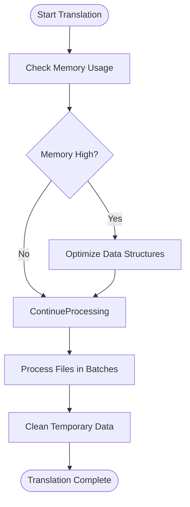
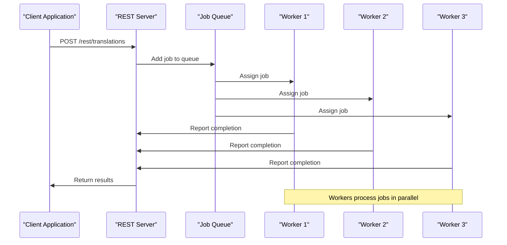

# Troubleshooting and Best Practices

<cite>
**Referenced Files in This Document**   
- [errors.pl](file://src/errors.pl)
- [apiTranslations.pl](file://src/apiTranslations.pl)
- [restServer.pl](file://src/restServer.pl)
- [gitUtilities.pl](file://src/gitUtilities.pl)
- [logging.pl](file://src/logging.pl)
- [threadSupport.pl](file://src/threadSupport.pl)
- [persistence.pl](file://src/persistence.pl)
- [reports.pl](file://src/reports.pl)
- [run_tests.sh](file://tests/scripts/run_tests.sh)
- [prepare_tests.sh](file://tests/scripts/prepare_tests.sh)
- [compare_test_results.sh](file://tests/scripts/compare_test_results.sh)
- [README.md](file://tests/README.md)
- [test_report_2025-12-16_22:38:31.diff](file://tests/reports/test_report_2025-12-16_22:38:31.diff)
</cite>

## Table of Contents
1. [Common Issues and Resolution Procedures](#common-issues-and-resolution-procedures)
2. [Error Message Interpretation](#error-message-interpretation)
3. [Performance Optimization](#performance-optimization)
4. [Source File Organization and Version Control](#source-file-organization-and-version-control)
5. [System Monitoring and Preventive Measures](#system-monitoring-and-preventive-measures)
6. [Disaster Recovery and Backup Strategies](#disaster-recovery-and-backup-strategies)

## Common Issues and Resolution Procedures

### Translation Errors
Translation errors in timelink-kleio typically occur due to malformed source files, incorrect structure file references, or syntax violations in Kleio files. The system provides detailed error reporting through the `errors.pl` module, which captures context information including file name, line number, and surrounding text.

To resolve translation errors:
1. Verify the source file syntax using the Kleio validator
2. Check that the structure file (stru) is correctly referenced in the request parameters or file header
3. Ensure the structure file exists and is accessible
4. Review the error report (rpt) and error file (err) for specific error messages and line numbers

The translation process uses a robust error handling mechanism that continues processing when possible, but stops after reaching the maximum error count (default 100). This prevents cascading failures from a single corrupted file.

**Section sources**
- [errors.pl](file://src/errors.pl#L77-L106)
- [apiTranslations.pl](file://src/apiTranslations.pl#L433-L455)

### API Timeouts
API timeouts occur when requests exceed the server's configured timeout limits. The REST server has a default timeout of 300 seconds, while JSON-RPC requests have a 30-minute limit. Timeouts can be caused by large translation jobs, network latency, or server resource constraints.

To resolve API timeouts:
1. Increase the timeout value by setting the KLEIO_IDLE_TIMEOUT environment variable
2. Break large translation jobs into smaller batches
3. Use asynchronous processing with the spawn parameter set to "yes"
4. Monitor server resource usage and scale workers accordingly

The server implements proper timeout handling that cleans up abandoned jobs and releases resources.

**Section sources**
- [restServer.pl](file://src/restServer.pl#L347-L348)
- [restServer.pl](file://src/restServer.pl#L669-L674)

### Authentication Failures
Authentication failures occur when API requests lack valid tokens or when tokens don't have required permissions. The system uses token-based authentication with role-based access control.

Common causes and solutions:
1. Missing token: Include a valid token in the Authorization header as "Bearer TOKEN"
2. Expired bootstrap token: Set KLEIO_ADMIN_TOKEN environment variable or regenerate tokens
3. Insufficient permissions: Ensure the token has the required API permissions (translations, upload, etc.)
4. Token database issues: Verify token_db file exists and is accessible

The authentication system provides clear error messages and supports both environment-based and database-stored tokens.

**Section sources**
- [restServer.pl](file://src/restServer.pl#L560-L562)
- [restServer.pl](file://src/restServer.pl#L276-L292)

### Git Conflicts
Git conflicts arise when multiple users modify the same files concurrently. The system integrates with Git for version control, but doesn't automatically resolve conflicts.

To prevent and resolve Git conflicts:
1. Pull latest changes before starting work
2. Commit and push changes frequently
3. Use feature branches for significant changes
4. Resolve conflicts locally before pushing

The gitUtilities.pl module provides functions to check repository status, fetch updates, and manage commits, helping users maintain synchronization with remote repositories.

**Section sources**
- [gitUtilities.pl](file://src/gitUtilities.pl#L38-L81)
- [gitUtilities.pl](file://src/gitUtilities.pl#L201-L223)

## Error Message Interpretation

### Understanding errors.pl Output
The errors.pl module provides comprehensive error reporting with contextual information. Error messages include:

- **Error type**: ERROR or WARNING prefixes
- **File and line number**: Source file and line where the issue was detected
- **Context lines**: Previous and current lines for context
- **Error count**: Current error and warning counts

The error reporting system uses the `error_out/1` and `error_out/2` predicates to output messages, which are captured in both console output and report files. Warnings use `warning_out/1` and `warning_out/2` predicates.

Key error handling functions:
- `initErrorCount/0`: Initializes error and warning counters
- `perror_count/0`: Prints final error and warning counts
- `check_continuation/0`: Determines if translation should continue based on error count

**Section sources**
- [errors.pl](file://src/errors.pl#L77-L106)
- [errors.pl](file://src/errors.pl#L200-L208)

### Diagnostic Information in Test Reports
Test reports provide comprehensive diagnostics for system validation. The test framework compares output from stable and development versions of the translator, filtering out expected differences.

Key components of test reports:
- **Timestamp and environment**: Test execution time and working directory
- **Configuration details**: Reference sources, test translations, and translator versions
- **Execution timing**: Duration of translation processes
- **Comparison results**: Diff output showing differences between expected and actual results

The test framework uses `run_tests.sh` to orchestrate testing, which:
1. Sets up test environment variables
2. Translates reference sources with stable translator
3. Translates sources with development version
4. Compares results using `compare_test_results.sh`

The comparison filters out expected differences (paths, timestamps, IDs) using patterns in `exclude_while_comparing.grep`.

**Section sources**
- [run_tests.sh](file://tests/scripts/run_tests.sh#L1-L39)
- [compare_test_results.sh](file://tests/scripts/compare_test_results.sh#L1-L9)
- [test_report_2025-12-16_22:38:31.diff](file://tests/reports/test_report_2025-12-16_22:38:31.diff#L1-L2)

## Performance Optimization

### Memory Management
Effective memory management is critical for handling large translation jobs. The system uses Prolog's garbage collection, but certain practices can optimize memory usage:

1. **Use appropriate data structures**: Utilize dictionaries and sets for efficient lookups
2. **Limit dynamic predicates**: Minimize use of assert/retract operations
3. **Process files in batches**: Avoid loading all files into memory simultaneously
4. **Clean up temporary data**: Ensure temporary files and data structures are properly cleaned

The persistence.pl module provides thread-safe value storage that helps manage memory across concurrent operations.

**Diagram sources**
- [persistence.pl](file://src/persistence.pl#L31-L42)
- [persistence.pl](file://src/persistence.pl#L58-L63)

**Section sources**
- [persistence.pl](file://src/persistence.pl#L1-L380)

### Parallel Processing Strategies
The system supports parallel processing through worker threads, significantly improving throughput for multiple translation jobs.

Key parallel processing features:
- **Worker pool**: Configurable number of worker threads (KLEIO_WORKERS)
- **Job queuing**: Tasks are queued and distributed to available workers
- **Thread safety**: Shared data structures are protected with mutexes
- **Load balancing**: Jobs are distributed to prevent worker overload

The threadSupport.pl module manages the worker pool and job distribution. The spawn parameter in translation requests controls whether files are processed in parallel (spawn=yes) or sequentially (spawn=no).

For optimal performance:
1. Set KLEIO_WORKERS based on available CPU cores
2. Use spawn=yes for independent files
3. Use spawn=no for files sharing structure files
4. Monitor worker utilization and adjust configuration

**Diagram sources**
- [threadSupport.pl](file://src/threadSupport.pl#L41-L62)
- [apiTranslations.pl](file://src/apiTranslations.pl#L77-L82)

**Section sources**
- [threadSupport.pl](file://src/threadSupport.pl#L1-L153)
- [apiTranslations.pl](file://src/apiTranslations.pl#L45-L49)

### Efficient Structure Design
Well-designed structure files improve translation performance and accuracy. Key principles:

1. **Modular design**: Break large structures into smaller, reusable components
2. **Clear hierarchy**: Organize elements in logical groups
3. **Consistent naming**: Use standardized naming conventions
4. **Minimal redundancy**: Avoid duplicate definitions

The system searches for structure files in multiple locations with priority:
1. Explicitly specified in request parameters
2. Directory-specific structure files (filename-structure.yaml)
3. Project-specific structure files in structures directory
4. Default structure file (gacto2.str)

Optimize structure file loading by:
- Using consistent file naming
- Placing frequently used structures in accessible locations
- Caching structure file parsing results

**Section sources**
- [apiTranslations.pl](file://src/apiTranslations.pl#L304-L417)

## Source File Organization and Version Control

### Best Practices for Source File Organization
Effective source file organization improves maintainability and collaboration. Recommended practices:

1. **Directory structure**: Organize files by type or project
   - sources/reference_sources: Reference files for testing
   - sources/test_translations: Test output files
   - structures: Structure definition files
   - reports: Translation reports and test results

2. **File naming conventions**:
   - Use descriptive names
   - Include version or date when appropriate
   - Follow consistent extension usage (.cli, .str, .yaml)

3. **Configuration management**:
   - Use environment variables for system configuration
   - Store sensitive data (tokens) securely
   - Document all configuration options

The system uses environment variables extensively for configuration, allowing easy adaptation to different environments.

**Section sources**
- [prepare_tests.sh](file://tests/scripts/prepare_tests.sh#L9-L28)
- [restServer.pl](file://src/restServer.pl#L109-L118)

### Version Control Workflows
Effective Git workflows ensure code quality and collaboration. Recommended practices:

1. **Branching strategy**:
   - Use main branch for stable code
   - Create feature branches for new development
   - Use release branches for version stabilization

2. **Commit practices**:
   - Make small, focused commits
   - Write descriptive commit messages
   - Include issue references when applicable

3. **Synchronization**:
   - Pull frequently to stay current
   - Push completed work regularly
   - Resolve conflicts promptly

The gitUtilities.pl module provides functions to support these workflows, including status checking, fetching, pulling, pushing, and commit operations.

**Section sources**
- [gitUtilities.pl](file://src/gitUtilities.pl#L7-L14)
- [gitUtilities.pl](file://src/gitUtilities.pl#L48-L57)

## System Monitoring and Preventive Measures

### Monitoring Server Activity
Regular monitoring helps maintain system health and identify issues early. Key monitoring activities:

1. **Server status**: Check server availability and response times
2. **Resource usage**: Monitor CPU, memory, and disk usage
3. **Job queue**: Track pending and processing jobs
4. **Error rates**: Watch for increasing error counts

The system provides several monitoring tools:
- `show_server_activity/0`: Displays current server status and running threads
- `print_server_config/0`: Shows current configuration values
- Home page: Provides real-time server status and statistics

Regular monitoring prevents resource exhaustion and ensures optimal performance.

**Section sources**
- [restServer.pl](file://src/restServer.pl#L375-L386)
- [restServer.pl](file://src/restServer.pl#L186-L226)

### Preventive Measures for System Stability
Proactive measures prevent common issues and maintain system stability:

1. **Regular testing**: Run semantic tests frequently to catch regressions
2. **Backup strategy**: Implement regular backups of critical data
3. **Configuration validation**: Verify configuration before deployment
4. **Resource monitoring**: Set up alerts for resource thresholds

Additional preventive measures:
- Use the test framework to validate changes
- Monitor Git repository synchronization
- Regularly update dependencies
- Document configuration changes

These practices reduce downtime and improve system reliability.

**Section sources**
- [run_tests.sh](file://tests/scripts/run_tests.sh#L1-L39)
- [restServer.pl](file://src/restServer.pl#L331-L342)

## Disaster Recovery and Backup Strategies

### Backup Procedures
Regular backups protect against data loss. Recommended backup strategy:

1. **Frequency**: Daily backups for production systems
2. **Retention**: Keep multiple generations of backups
3. **Storage**: Store backups in separate physical locations
4. **Verification**: Regularly test backup restoration

Critical data to back up:
- Source files (.cli, .kleio)
- Structure files (.str, .yaml)
- Configuration files
- Token database
- Translation outputs

Automate backups using scripts that copy critical directories to secure locations.

**Section sources**
- [prepare_tests.sh](file://tests/scripts/prepare_tests.sh#L31-L39)

### Recovery Procedures
Effective recovery procedures minimize downtime after failures. Steps for system recovery:

1. **Assessment**: Identify the scope and cause of failure
2. **Isolation**: Prevent further damage or data corruption
3. **Restoration**: Restore from latest valid backup
4. **Validation**: Verify system functionality
5. **Monitoring**: Closely monitor system after recovery

For database corruption:
1. Stop the server
2. Restore token_db from backup
3. Restart the server
4. Verify authentication works

For configuration issues:
1. Restore configuration files from backup
2. Restart services
3. Verify proper operation

Document recovery procedures and test them regularly to ensure effectiveness.

**Section sources**
- [restServer.pl](file://src/restServer.pl#L394-L421)
- [gitUtilities.pl](file://src/gitUtilities.pl#L291-L313)