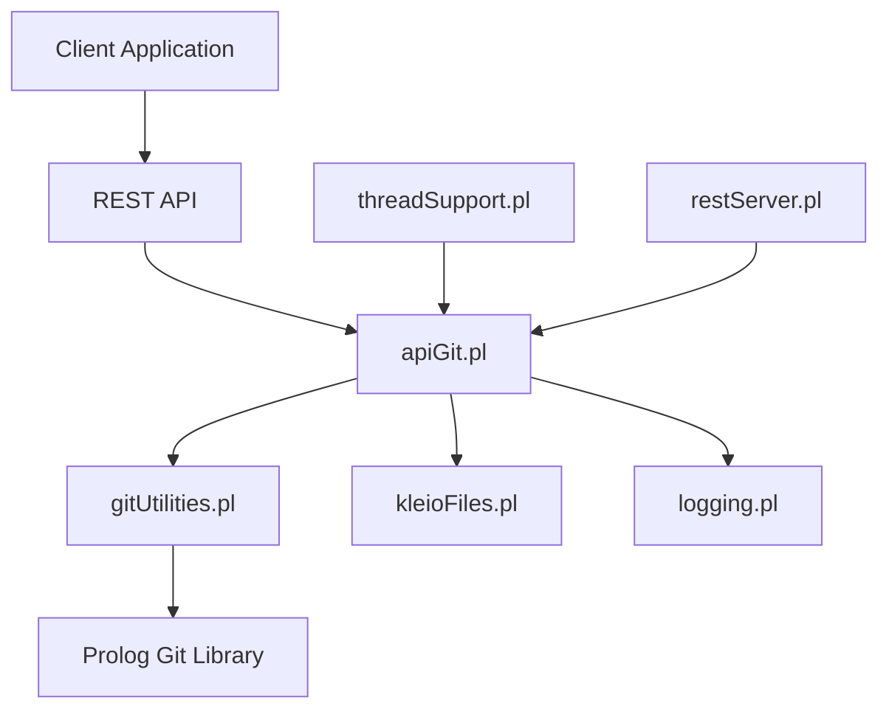

# Version Control Integration

<cite>
**Referenced Files in This Document**   
- [apiGit.pl](file://src/apiGit.pl)
- [gitUtilities.pl](file://src/gitUtilities.pl)
- [threadSupport.pl](file://src/threadSupport.pl)
- [kleioFiles.pl](file://src/kleioFiles.pl)
- [restServer.pl](file://src/restServer.pl)
- [logging.pl](file://src/logging.pl)
</cite>

## Table of Contents
1. [Introduction](#introduction)
2. [Git Integration Architecture](#git-integration-architecture)
3. [API Endpoints for Git Operations](#api-endpoints-for-git-operations)
4. [Internal Implementation with gitUtilities.pl](#internal-implementation-with-gitutilitiespl)
5. [Thread-Safe Git Operations](#thread-safe-git-operations)
6. [Workflow Examples](#workflow-examples)
7. [Configuration Options](#configuration-options)
8. [Common Issues and Solutions](#common-issues-and-solutions)
9. [Best Practices for Repository Integrity](#best-practices-for-repository-integrity)

## Introduction
The timelink-kleio system provides comprehensive Git integration for source file versioning and collaborative editing. This documentation details how the system interfaces with Git repositories through a REST API, implements thread-safe operations, and manages configuration and error handling. The integration enables users to perform essential Git operations such as commit, push, pull, and status checks directly through the API, facilitating collaborative workflows while maintaining repository integrity.

**Section sources**
- [apiGit.pl](file://src/apiGit.pl#L1-L201)
- [gitUtilities.pl](file://src/gitUtilities.pl#L1-L686)

## Git Integration Architecture
The Git integration in timelink-kleio follows a modular architecture with clear separation of concerns. The system consists of three main components: the API layer (apiGit.pl), the utility layer (gitUtilities.pl), and the thread management layer (threadSupport.pl). The API layer exposes Git operations through REST endpoints, while the utility layer implements the actual Git commands using Prolog's git library. The thread management layer ensures that Git operations are executed in a thread-safe manner, preventing race conditions when multiple users access the same repository simultaneously.

The architecture leverages the kleioFiles.pl module to resolve file paths and directory structures, ensuring that Git operations are performed on the correct repository. The restServer.pl module handles HTTP requests and responses, while logging.pl provides comprehensive logging for debugging and monitoring Git operations. This layered approach enables robust error handling and makes the system extensible for future enhancements.

**Diagram sources**
- [apiGit.pl](file://src/apiGit.pl#L1-L201)
- [gitUtilities.pl](file://src/gitUtilities.pl#L1-L686)
- [threadSupport.pl](file://src/threadSupport.pl#L1-L153)
- [kleioFiles.pl](file://src/kleioFiles.pl#L1-L933)
- [restServer.pl](file://src/restServer.pl#L1-L1802)
- [logging.pl](file://src/logging.pl#L1-L161)

## API Endpoints for Git Operations
The /versions API endpoints provide a comprehensive interface for Git operations in timelink-kleio. These endpoints support standard HTTP methods to perform different types of operations: GET for retrieving information, PUT for modifying the working directory, and POST for push operations. The API uses pseudo-paths to define which information to retrieve or which operation to perform.

The main endpoints include:
- **GET /versions/status/global**: Retrieves the global status of the repository, including information about the current branch, remote tracking, and divergence from the origin.
- **PUT /versions/commit**: Adds specified files to the index and commits them with a provided message.
- **PUT /versions/push**: Pushes local commits to the remote repository.
- **GET /versions/pull**: Pulls changes from the remote repository (note: incorrectly implemented as GET instead of PUT).
- **PUT /versions/set-user-info**: Sets the user name and email for Git commits.
- **DELETE /versions/reset**: Resets the repository to a specified commit.

Each endpoint requires proper authentication via tokens and checks permissions before executing operations. The API returns structured responses containing operation results, error messages, and exit statuses, enabling clients to handle different scenarios appropriately.

**Section sources**
- [apiGit.pl](file://src/apiGit.pl#L1-L201)

## Internal Implementation with gitUtilities.pl
The gitUtilities.pl module provides the core implementation of Git operations in timelink-kleio. This module defines predicates for various Git commands, including git_global_status/3, git_pull/2, git_push/2, git_commit/5, and git_reset/4. Each predicate wraps the corresponding Git command, handling parameters, options, and response processing.

The module implements several key features:
- **Status tracking**: The git_global_status/3 predicate provides a comprehensive overview of the repository state, including divergence from the origin, local changes, and fetch status.
- **Branch management**: Functions like git_ahead_behind/5 and git_remotes_branches_info/3 enable tracking of branch divergence and remote branch information.
- **Error handling**: Operations include comprehensive error handling, with specific error codes and messages returned for different failure scenarios.
- **Configuration management**: The module provides functions to get and set Git user information (name and email) through git_user_info/4 and git_set_user_info/4.

The implementation uses Prolog's built-in git library to execute commands, passing appropriate parameters and options. Results are processed and returned in structured formats, making them easy to consume by the API layer. The module also includes utility functions for parsing Git output and formatting results for display.

**Section sources**
- [gitUtilities.pl](file://src/gitUtilities.pl#L1-L686)

## Thread-Safe Git Operations
timelink-kleio ensures thread-safe Git operations through the threadSupport.pl module, which implements a worker pool pattern for handling concurrent requests. The create_workers/1 predicate creates a pool of worker threads, while post_job/2 dispatches jobs to available workers. This approach prevents race conditions when multiple users attempt to perform Git operations on the same repository simultaneously.

The thread support system uses message queues to communicate between the main server thread and worker threads. When a Git operation is requested, it is posted as a job to the message queue, where it waits until a worker thread becomes available. The worker thread then executes the operation in isolation, ensuring that no two operations modify the repository state concurrently.

Key features of the thread-safe implementation include:
- **Job queuing**: Jobs are queued and processed in order, preventing conflicts between simultaneous operations.
- **Status tracking**: The system maintains information about queued and processing jobs, allowing monitoring of operation progress.
- **Error isolation**: Each job runs in its own thread context, isolating errors and preventing them from affecting other operations.
- **Resource management**: The worker pool limits the number of concurrent operations, preventing resource exhaustion.

This thread-safe approach enables collaborative editing scenarios where multiple users can work on the same repository without risking data corruption or conflicts.

**Section sources**
- [threadSupport.pl](file://src/threadSupport.pl#L1-L153)
- [apiGit.pl](file://src/apiGit.pl#L1-L201)

## Workflow Examples
### Collaborative Editing Scenario
In a typical collaborative editing workflow, multiple users work on different aspects of the same project. User A makes changes to source files and commits them locally using the /versions/commit endpoint. User B, working on a different feature, also makes changes and commits locally. When User A pushes their changes to the remote repository using /versions/push, User B can pull these changes using /versions/pull before committing their own work. This ensures that User B's changes are based on the latest version of the code.

### Conflict Resolution
When conflicts occur during a pull operation, the system provides information about the conflicting files through the git status output. Users can resolve conflicts by manually editing the conflicting files, then committing the resolved version. The API does not automatically resolve conflicts but provides the necessary information for users to understand and resolve them.

### Branch Management
The system supports branch management through the git_remotes_branches_info/3 predicate, which retrieves information about remote branches. Users can create feature branches, work on them independently, and merge them back to the main branch when complete. The git_ahead_behind/5 predicate helps track the divergence between branches, indicating how many commits each branch is ahead or behind the other.

**Section sources**
- [apiGit.pl](file://src/apiGit.pl#L1-L201)
- [gitUtilities.pl](file://src/gitUtilities.pl#L1-L686)

## Configuration Options
timelink-kleio provides several configuration options for Git repositories, remote URLs, and authentication. These options can be set through environment variables or API calls:

- **Repository location**: The KLEIO_HOME_DIR environment variable determines the base directory for Git repositories. The system searches for repositories in standard locations like /kleio-home, /timelink-home, or /mhk-home.
- **Remote URLs**: The git_set_remote_url/4 predicate allows changing the remote URL for a repository. This is useful when migrating repositories or changing authentication methods.
- **User information**: The git_set_user_info/4 predicate sets the user name and email for Git commits, which is important for proper attribution.
- **Authentication**: Authentication is handled through tokens passed in API requests. The system checks token permissions before allowing Git operations.

Additional configuration options include:
- **Workers**: The KLEIO_SERVER_WORKERS environment variable controls the number of worker threads for handling concurrent operations.
- **Timeouts**: The KLEIO_IDLE_TIMEOUT variable sets the idle timeout for the server.
- **CORS**: The KLEIO_CORS_SITES variable configures cross-origin resource sharing for web clients.

**Section sources**
- [kleioFiles.pl](file://src/kleioFiles.pl#L1-L933)
- [restServer.pl](file://src/restServer.pl#L1-L1802)
- [apiGit.pl](file://src/apiGit.pl#L1-L201)

## Common Issues and Solutions
### Merge Conflicts
Merge conflicts occur when two users modify the same part of a file. The system detects conflicts during pull operations and reports them through the git status output. Solutions include:
- Communicating with other team members to coordinate changes
- Using the git status information to identify conflicting files
- Manually resolving conflicts by editing the files
- Committing the resolved version

### Repository Corruption
Repository corruption can occur due to interrupted operations or disk errors. Prevention measures include:
- Ensuring proper shutdown procedures
- Regularly verifying repository integrity with git fsck
- Maintaining backups of important repositories

If corruption occurs, solutions include:
- Restoring from backups
- Using git fsck to identify and repair corruption
- Cloning the repository from a known good remote

### Network Timeouts
Network timeouts during push or pull operations can be addressed by:
- Increasing timeout values in the client configuration
- Ensuring stable network connectivity
- Using git's built-in retry mechanisms
- Breaking large operations into smaller chunks

The system logs network errors through the logging.pl module, making it easier to diagnose and resolve connectivity issues.

**Section sources**
- [gitUtilities.pl](file://src/gitUtilities.pl#L1-L686)
- [logging.pl](file://src/logging.pl#L1-L161)

## Best Practices for Repository Integrity
To maintain repository integrity in timelink-kleio, follow these best practices:

1. **Regular commits**: Commit changes frequently with descriptive messages to create a clear history.
2. **Pull before push**: Always pull the latest changes before pushing to minimize conflicts.
3. **Use branches**: Create feature branches for new development to isolate changes from the main branch.
4. **Review changes**: Use the git status and diff commands to review changes before committing.
5. **Backup regularly**: Maintain regular backups of important repositories.
6. **Monitor logs**: Regularly review system logs for any Git operation errors or warnings.
7. **Limit permissions**: Use token-based authentication to limit Git operations to authorized users.
8. **Test changes**: Test changes thoroughly before committing to ensure they don't break existing functionality.

These practices help ensure that the repository remains in a consistent state and that collaborative editing proceeds smoothly without data loss or corruption.

**Section sources**
- [apiGit.pl](file://src/apiGit.pl#L1-L201)
- [gitUtilities.pl](file://src/gitUtilities.pl#L1-L686)
- [logging.pl](file://src/logging.pl#L1-L161)